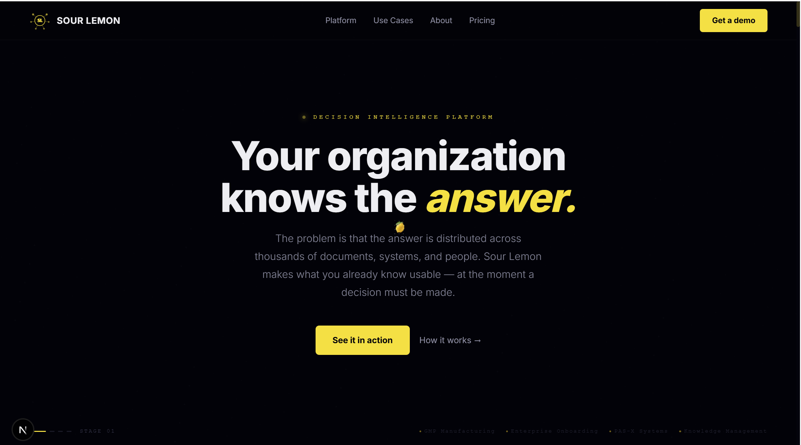
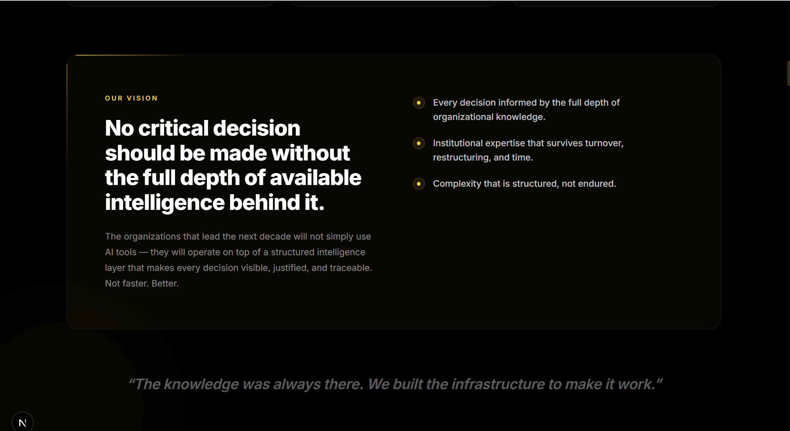
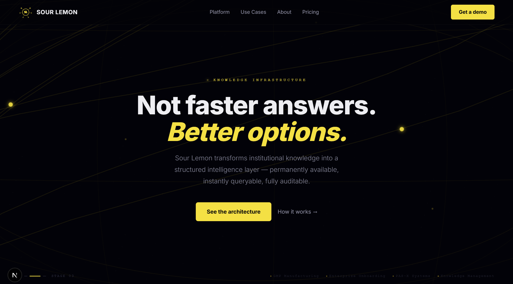
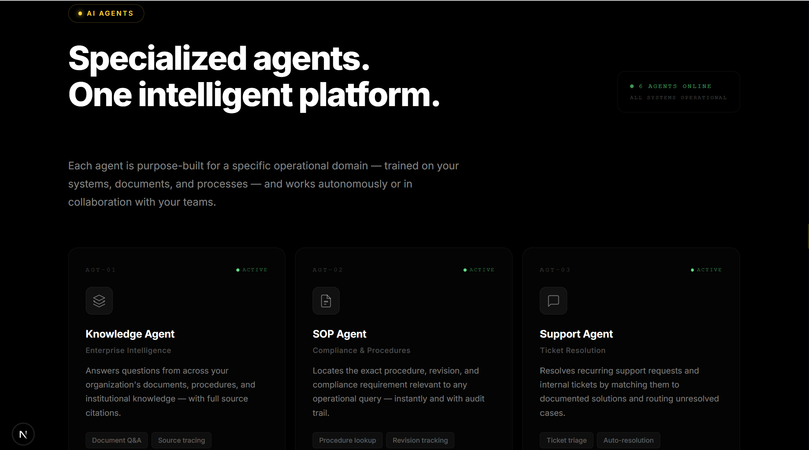
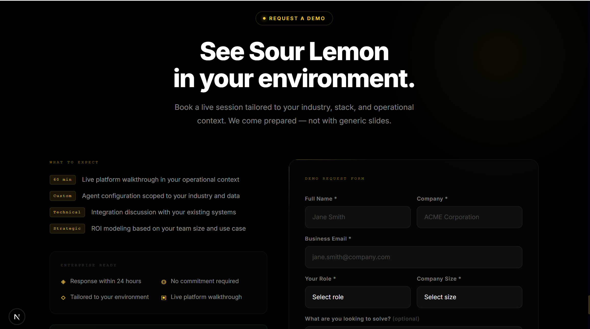

# 🍋 Sour Lemon

<p align="center">
  
</p>
AI-powered enterprise knowledge platform for intelligent information retrieval, operational decision support, and organizational knowledge management.

Sour Lemon is a product concept exploring how AI can help organizations transform scattered internal knowledge into structured, searchable, and reusable intelligence.

> Current status: Frontend demo / work in progress

## Live Demo

Visit the interactive portfolio demo at [mahbejam.github.io/sour-lemon](https://mahbejam.github.io/sour-lemon/).

## Overview

Organizations often have valuable information distributed across documents, systems, teams, and informal processes. Sour Lemon is designed as a concept platform that demonstrates how this knowledge can become easier to find, understand, and use.

The current version focuses on the frontend experience, product structure, and visual presentation of the platform.

## Core Idea

Sour Lemon is built around a simple principle:

> Information is only valuable when people can find it, trust it, and reuse it.

## Key Areas

- AI-assisted knowledge discovery
- Enterprise information retrieval
- Operational decision support
- Institutional knowledge management
- Product-oriented frontend architecture
- Scalable UI foundation

## Application Features

- Cinematic animated hero with keyboard-accessible stage navigation
- Responsive navigation with working section links and demo CTAs
- Interactive platform preview with knowledge search, assistant chat, ticket automation, and executive insight views
- Expandable product architecture and agent surfaces
- Illustrative success stories with switchable scenarios
- Responsive demo request form with browser validation and a local success state
- Reduced dependency on unavailable backend services: search, chat, and form submission use simulated sample data in the browser
- Static-export configuration for the GitHub Pages project URL

## Technology Stack

- Next.js
- React
- TypeScript
- Tailwind CSS
- Framer Motion
- Radix UI primitives
- Lucide React
- Zustand

The current demo has no backend. Form submissions are intentionally simulated locally and are not stored or transmitted.

## Project Status

This repository currently contains the frontend demo of Sour Lemon.  
The project is actively evolving and will be expanded step by step.

Planned next steps:

- Complete frontend sections
- Improve responsive design
- Add product screenshots
- Add architecture documentation
- Prepare backend concept
- Add AI workflow examples
- Create full product documentation

## Roadmap

- [x] Frontend foundation
- [x] Landing page structure
- [x] Product concept sections
- [ ] Responsive optimization
- [ ] Screenshots and demo assets
- [ ] Architecture diagram
- [ ] Backend/API concept
- [ ] AI search workflow
- [ ] Final portfolio documentation

## Running Locally

```bash
npm install
npm run dev
```

To create the GitHub Pages-ready static output:

```bash
npm run build
```

The exported site is written to `out/` and is configured for `/sour-lemon/`.
---


# Screenshots

## Product Vision



---

## System Architecture



---

## AI Agents



---

## Demo



## Credits

Original idea and product concept by Mahbube bubeh.

Designed and developed by Mahbejam.

This project was created as part of a creative software engineering portfolio.
